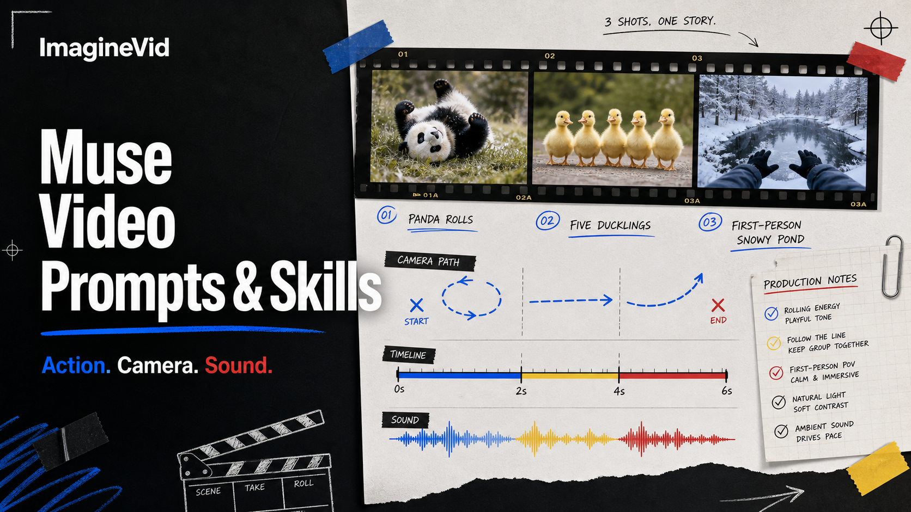

<a href="https://github.com/imagineVid/Awesome-muse-video-prompts-and-skills">
  
</a>

> 面向 Muse Video、可核验来源的镜头简报、运动模式与视听工作流库。
# Awesome Muse Video 提示词与技能

[](https://github.com/sindresorhus/awesome)
[](https://github.com/imagineVid/Awesome-muse-video-prompts-and-skills)
[](https://creativecommons.org/licenses/by/4.0/)
[](https://github.com/imagineVid/Awesome-muse-video-prompts-and-skills/actions)
[](docs/CONTRIBUTING.md)

> 研究简报、观看结果、追溯创作者，并复用导演逻辑，而不是照搬表面风格。

> **署名与更正：** 每个已发布案例都链接创作者与规范来源。权利归其所有者所有。如需更正署名或移除内容，请提交 issue。

---

[](README.md) [](README.es.md) [](README.pt.md) [](README.it.md) [](README.de.md) [](README.fr.md) [](README.ar.md) [](README.ja.md) [](README.ko.md) [](README.zh.md)
[](README.nl.md) [](README.ru.md) [](README.tr.md) [](README.pl.md)

---

## 使用 Muse Video 创作

**[在 ImagineVid 中打开 Muse Video 工作流](https://imaginevid.io/zh/reference-video)**

用本仓库比较创作者指令与最终运动效果。准备将镜头语法改编成新片段时，打开 ImagineVid。

热度不是证据。带有完整提示词和有用视频的低互动帖子，可能优于没有可复现指导的病毒式展示。

| 制作需求 | 证据库 | ImagineVid 工作流 |
|---------|--------------|---------------------|
| 案例评审 | 提示词、结果与来源 | 生成并比较 |
| 发现 | 仓库文本搜索 | 按工作流探索 |
| 生成 | - | 打开 Muse Video |
| 阅读 | GitHub 原生 Markdown | 浏览器制作工作区 |
| 视频工作流 | - | 制作筛选器 |


### 按制作工作流浏览

- [**物理运动与时间一致性**](#workflow-physical-motion-temporal-consistency) - 检验重量、接触、加速度、平衡与时间连续性的运动简报。
- [**动物、计数与主体连续性**](#workflow-animals-counting-subject-continuity) - 在运动中保持动物身份、主体数量、解剖结构与空间关系稳定的案例。
- [**原生音频、对白与拟音**](#workflow-native-audio-dialogue-foley) - 把对白、表演、环境声、音乐或同步拟音纳入镜头设计的提示词。
- [**镜头语言与沉浸式主观视角**](#workflow-camera-language-immersive-pov) - 围绕镜头路径、构图、视角、揭示与第一人称沉浸设计的镜头简报。
- [**商业叙事节拍与产品运动**](#workflow-commercial-story-beats-product-motion) - 明确产品、受众、叙事节拍、运动方案与收尾画面的商业简报。
- [**风格化动画与教育演示**](#workflow-stylized-animation-educational-motion) - 由明确媒介、变形规则或视觉教学序列驱动的动画与说明性运动。

---

## 目录

- [使用 Muse Video 创作](#使用-muse-video-创作)
- [什么是 Muse Video？](#什么是-muse-video)
- [官方预览案例](#official-capability-cases)
- [集合状态](#集合状态)
- [精选视频提示词](#community-featured-prompts)
- [视频提示词工作流](#community-prompt-cases)
- [贡献已核验案例](#贡献已核验案例)
- [许可证](#许可证)
- [创作者鸣谢](#创作者鸣谢)
- [仓库增长](#仓库增长)

---

## 什么是 Muse Video？

**Muse Video** 是 Meta 于 2026 年 7 月预览、尚待正式开放的视频生成模型。它与 Muse Image 共享预训练基础，目标是生成原生音频视频、遵循详细提示词，并保持视觉与时间一致性。Meta 表示它将很快面向创作者和 Meta AI 推出，并未将其描述为已普遍开放的公共 API。Meta 也明确承认，音画同步和高速运动的物理准确性仍有不足。

下面的案例把每条提示词当作制作简报，将可见动作、镜头行为、节拍、声音、连续性约束和证据视频放在一起。

- **从文本或画面开始** - 根据文字场景生成，或让已经承载构图的图像动起来
- **描述可观察的运动** - 写清调度、动量、物体交互，以及每个动作造成的物理后果
- **写节拍，不写梗概** - 时序重要时，使用时间码或简短动作序列
- **让声音与场景一起生成** - 故事需要音频时加入对白、环境声、音乐或音效
- **锁定准确数量与身份** - 明确哪些主体、面孔、物体和空间关系必须保持稳定
- **明确保护连续性** - 指出脸部、产品结构、布局、服装或背景中不能漂移的部分

**当前参考：** [Meta AI engineering overview](https://ai.meta.com/blog/introducing-muse-image-muse-video-msl/) · [Meta product announcement](https://about.fb.com/news/2026/07/introducing-muse-image-meta-ai/) · [Create videos on ImagineVid](https://imaginevid.io/zh/reference-video)

### 把提示词变成镜头模板

可复用的视频提示词将场景变量与导演逻辑分开。替换主体、环境、台词或产品，同时保留经过验证的镜头路径、节拍结构、声音方案和连续性规则。

**模板模式：**
```
[DURATION + ASPECT RATIO]。[SUBJECT] 在 [SETTING] 中执行 [VISIBLE ACTION]。Camera: [FRAMING + MOVE]。Beats: [TIMED ACTIONS]。Audio: [DIALOGUE + FOLEY + AMBIENCE]。Preserve: [IDENTITY / PRODUCT / LAYOUT]。Avoid: [FAILURE MODES]。
```

从一个动作和一个镜头想法开始。只有在解决可见制作需求时才加入时间、音频和保留约束；然后每次生成只改变一个变量。

---

<a id="official-capability-cases"></a>

## 官方预览案例

> 来自官方预览的可播放片段。编辑标题已本地化，官方来源提示词保留英文以便核验。

<a id="official-official-preview-clips"></a>

### Official Muse Video Preview Clips

Playable clips published by Meta and Alexandr Wang during the July 7, 2026 preview. Muse Video was still described as coming soon, not generally available.

<a id="official-case-1"></a>

#### 案例 1: Elephant at a dinner party


**官方来源提示词（英文）:**

```
Editorial reconstruction from the official preview: keep a full-size elephant, six guests, table setting, room geometry, reactions, and warm practical light coherent in one comic dinner-party shot.
```

---

<a id="official-case-2"></a>

#### 案例 2: Baby panda tumbling down a grassy slope


**官方来源提示词（英文）:**

```
A baby panda tumbling head over heels down a small grassy slope.
```

---

<a id="official-case-3"></a>

#### 案例 3: Four-orange juggling failure and bow


**官方来源提示词（英文）:**

```
A man juggles three oranges, adds a fourth, drops them all, and takes a bow anyway. Warm natural morning light, gentle slow motion, one continuous approximately ten-second moment, quiet room tone, and crisp foley.
```

---

<a id="official-case-4"></a>

#### 案例 4: Exactly five ducklings climb a step


**官方来源提示词（英文）:**

```
A mother duck leads exactly five ducklings toward a curb; the fifth struggles, then hops up to rejoin the same group. Never add, remove, or duplicate a duckling.
```

---

<a id="official-case-5"></a>

#### 案例 5: Immersive half-frozen pond walk


**官方来源提示词（英文）:**

```
First-person night walk beside a half-frozen pond in falling snow, with warm lamplight on dark water, natural handheld gait, footsteps, breeze, reeds, and quiet winter ambience.
```

---

## 集合状态

<div align="center">

| 集合字段 | 当前值 |
|--------|-------|
| 已核验案例 | **6** |
| 编辑精选 | **4** |
| 生成时间 | **2026年7月22日星期三 UTC 10:25:58** |

</div>

---

<a id="community-featured-prompts"></a>

## 精选视频提示词

> 按可复现性、运动清晰度和制作实用性选取

<a id="prompt-1"></a>

### #1: 尴尬晚宴中的大象


#### 工作流为何重要

根据官方预览重构的镜头，用于测试比例、遮挡、人物反应与室内连续性。

#### 本地化提示词

```
一头照片级真实的大象不可思议地站在一间温暖灯光的小餐厅里，现场正在举行正式晚宴。六名成年人围坐在摆有烤肉、蜡烛、鲜花和酒杯的餐桌旁。大象占据房间后方，却没有破坏墙壁或家具；它把鼻子伸向前方，客人注意到它后先克制地惊讶，随后笑起来。采用与人眼等高的一镜到底，轻微手持漂移，自然视线关系，可信接触阴影，大象比例始终一致，暖色实景灯，室内底噪，轻微餐具声、椅子移动声与大象柔和呼吸声。不要剪切，不要复制客人，不要改变餐桌布局。
```

<details>
<summary>原始来源提示词</summary>

```
A photorealistic elephant stands improbably inside a small, warmly lit dining room during a formal dinner party. Six adults sit around a table with roast dinner, candles, flowers, and wine glasses. The elephant fills the back of the room without breaking the walls or furniture; its trunk reaches forward as the guests notice it and react with restrained surprise, then laughter. One continuous eye-level shot with subtle handheld drift, natural eyelines, believable contact shadows, consistent elephant scale, warm practical lamps, room tone, quiet cutlery, chair movement, and a soft elephant breath. No cuts, no duplicated guests, no changing table layout.
```

</details>

#### 视频

<div align="center">
<a href="https://video.twimg.com/amplify_video/2074556635603673089/vid/avc1/1280x720/OJwJS5B7W51JCrdH.mp4?tag=28"></a>

*点击预览图打开视频* · **[▶ 观看视频 →](https://video.twimg.com/amplify_video/2074556635603673089/vid/avc1/1280x720/OJwJS5B7W51JCrdH.mp4?tag=28)**
</div>

#### 证据

- **创作者:** [Alexandr Wang](https://x.com/alexandr_wang)
- **规范来源:** [规范来源](https://x.com/alexandr_wang/status/2074556839782416555)
- **发布时间:** 2026年7月7日
- **提示词语言:** en

**[按此方向创作 · ImagineVid](https://imaginevid.io/zh/reference-video)**

---

<a id="prompt-2"></a>

### #2: 翻滚下草坡的熊猫幼崽


#### 工作流为何重要

Meta 的简短动物运动提示，用于观察身体连续性、接触物理、毛发和自然镜头反应。

#### 本地化提示词

```
一只熊猫幼崽在小草坡上头朝下连续翻滚。
```

<details>
<summary>原始来源提示词</summary>

```
A baby panda tumbling head over heels down a small grassy slope.
```

</details>

#### 视频

<div align="center">
<a href="https://video.twimg.com/amplify_video/2074556657825202177/vid/avc1/1280x720/CCByPOiRRLwPhYGM.mp4?tag=28"></a>

*点击预览图打开视频* · **[▶ 观看视频 →](https://video.twimg.com/amplify_video/2074556657825202177/vid/avc1/1280x720/CCByPOiRRLwPhYGM.mp4?tag=28)**
</div>

#### 证据

- **创作者:** [Meta Superintelligence Labs](https://x.com/AIatMeta)
- **规范来源:** [规范来源](https://x.com/alexandr_wang/status/2074556839782416555)
- **发布时间:** 2026年7月7日
- **提示词语言:** en

**[按此方向创作 · ImagineVid](https://imaginevid.io/zh/reference-video)**

---

<a id="prompt-3"></a>

### #3: 四个橙子的杂耍失误与喜剧收尾


#### 工作流为何重要

在十秒内协调计数、手物交互、失误、表演、自然物理与同步拟音。

#### 本地化提示词

```
一名男子先杂耍三个橙子，再加入第四个，最后全部掉落，但他仍然鞠躬谢幕。温暖自然的晨光，轻柔慢动作。约10秒的一镜到底，开端、转折和笑点清楚。音频：安静室内底噪与清晰拟音。照片级真实，自然光线与物理表现，像可信的真实拍摄。不要卡通，不要风格化。
```

<details>
<summary>原始来源提示词</summary>

```
A man juggles three oranges, adds a fourth, drops them all, and takes a bow anyway. Warm natural morning light, gentle slow motion. A single continuous approximately 10-second moment with a clear beginning, turn, and payoff. AUDIO: quiet room tone with crisp foley. Photorealistic, natural lighting and physics, believable real-world footage. Not a cartoon, not stylized.
```

</details>

#### 视频

<div align="center">
<a href="https://video.twimg.com/amplify_video/2074598559400247296/vid/avc1/1280x720/MT-tOwM5MF3PII-y.mp4?tag=28"></a>

*点击预览图打开视频* · **[▶ 观看视频 →](https://video.twimg.com/amplify_video/2074598559400247296/vid/avc1/1280x720/MT-tOwM5MF3PII-y.mp4?tag=28)**
</div>

#### 证据

- **创作者:** [Meta AI](https://x.com/AIatMeta)
- **规范来源:** [规范来源](https://x.com/AIatMeta/status/2074600027733860758)
- **发布时间:** 2026年7月7日
- **提示词语言:** en

**[按此方向创作 · ImagineVid](https://imaginevid.io/zh/reference-video)**

---

<a id="prompt-6"></a>

### #4: Blush Fizz 气泡柠檬水产品短片


#### 工作流为何重要

一支十秒饮料广告，用于检验标签稳定性、液体运动、气泡、配料连续性、微距焦点和品牌收尾。

#### 本地化提示词

```
为虚构粉色气泡柠檬水“BLUSH FIZZ”制作一支明亮的十秒桌面广告。开场是一只冰冷玻璃瓶斜放在碎冰中，周围有半只柠檬、覆盆子、薄荷、淡粉花瓣和凝结水珠。奶油色标签上的“BLUSH FIZZ”和“SPARKLING LEMONADE”必须始终清晰可读且不变形。切到侧面微距，瓶子把半透明粉色柠檬水连续倒入装有冰块、柠檬片、覆盆子和薄荷的高杯。展示上升气泡、真实折射、湿润杯壁和细小飞溅，不改变瓶子或配料数量。结尾用近距离英雄镜头展示装满的气泡饮料、柠檬轮、覆盆子、薄荷枝，以及右下角同一个虚构标志。粉色与薄荷色影棚，明亮柔光，浅景深，流畅产品运镜，清晰的倒水声和气泡声。不要手、人物、扭曲标签、额外文字或重复水果。
```

<details>
<summary>原始来源提示词</summary>

```
Create a bright ten-second tabletop commercial for a fictional sparkling pink lemonade named "BLUSH FIZZ". Open on a cold glass bottle lying diagonally in crushed ice with lemon halves, raspberries, mint leaves, pale rose petals, and condensation beads. Keep the cream label and the exact words "BLUSH FIZZ" and "SPARKLING LEMONADE" readable and unchanged. Cut to a side macro shot as the bottle tilts and pours translucent blush-pink lemonade into a clear highball glass filled with ice, lemon slices, raspberries, and mint. Show a continuous liquid stream, rising bubbles, realistic refraction, wet glass, and small splashes without changing the bottle or garnish count. Finish on a close hero shot of the full sparkling glass with a lemon wheel, raspberry, mint sprig, and the same fictional logo in the lower right. Soft pink and mint studio set, high-key diffused light, shallow depth of field, smooth product-camera motion, crisp pour and fizz sounds, no hands or people, no warped label, no extra text, no duplicate fruit.
```

</details>

#### 视频

<div align="center">
<a href="https://video.twimg.com/amplify_video/2074600543469916160/vid/avc1/1280x720/JN6ZLW31OGfxXY1c.mp4?tag=14"></a>

*点击预览图打开视频* · **[▶ 观看视频 →](https://video.twimg.com/amplify_video/2074600543469916160/vid/avc1/1280x720/JN6ZLW31OGfxXY1c.mp4?tag=14)**
</div>

#### 证据

- **创作者:** [Ishan Misra](https://x.com/imisra_)
- **规范来源:** [规范来源](https://x.com/imisra_/status/2074600764451041536)
- **发布时间:** 2026年7月7日
- **提示词语言:** en

**[按此方向创作 · ImagineVid](https://imaginevid.io/zh/reference-video)**

---

<a id="community-prompt-cases"></a>

## 视频提示词工作流

> 按来源日期和编辑价值排序.

<a id="workflow-physical-motion-temporal-consistency"></a>

### 物理运动与时间一致性 (2)

检验重量、接触、加速度、平衡与时间连续性的运动简报。

**精选视频提示词**

- [尴尬晚宴中的大象](#prompt-1)
- [四个橙子的杂耍失误与喜剧收尾](#prompt-3)

<a id="workflow-animals-counting-subject-continuity"></a>

### 动物、计数与主体连续性 (2)

在运动中保持动物身份、主体数量、解剖结构与空间关系稳定的案例。

**精选视频提示词**

- [翻滚下草坡的熊猫幼崽](#prompt-2)

<a id="prompt-4"></a>

#### #1: 恰好五只小鸭登上台阶


##### 工作流为何重要

严格保持五只动物稳定，通过最后一只的延迟动作构成障碍与解决。

##### 本地化提示词

```
一只母鸭带着恰好五只小鸭排成一列走向台阶；第五只也是最小的一只在台阶前挣扎，随后跳上去重新加入队伍。总数必须恰好为五只，并且整段视频始终是同样五只。绝不添加、移除、复制或改变小鸭数量；从头到尾保持五只都可见且一致。温暖室内灯光，真实家庭录像质感，略不完美的自然手持构图。约10秒的一镜到底，开端、障碍和结果清楚。音频：轻柔蹼足声、小声啾鸣、室内底噪、台阶刮擦声，最后一只成功时发出明亮叫声。
```

<details>
<summary>原始来源提示词</summary>

```
A mother duck leads a line of exactly FIVE ducklings toward a curb; the fifth and smallest duckling struggles at the step, then hops up to rejoin the others. There are exactly five ducklings in total — the same five throughout the entire video. Never add, remove, duplicate, or change the number of ducklings; keep all five visible and consistent from start to finish. Cozy indoor lamplight, authentic home-video look, slightly imperfect handheld framing with natural shake. One continuous approximately 10-second moment with a clear beginning, obstacle, and payoff. Audio: soft webbed footsteps, tiny chirps, room tone, a small scrape at the curb, then a bright chirp when the last duckling succeeds.
```

</details>

##### 视频

<div align="center">
<a href="https://video.twimg.com/amplify_video/2074598584318611457/vid/avc1/1280x720/CIfMgD_fBAcwbknm.mp4?tag=28"></a>

*点击预览图打开视频* · **[▶ 观看视频 →](https://video.twimg.com/amplify_video/2074598584318611457/vid/avc1/1280x720/CIfMgD_fBAcwbknm.mp4?tag=28)**
</div>

##### 证据

- **创作者:** [Meta AI](https://x.com/AIatMeta)
- **规范来源:** [规范来源](https://x.com/AIatMeta/status/2074600027733860758)
- **发布时间:** 2026年7月7日
- **提示词语言:** en

**[按此方向创作 · ImagineVid](https://imaginevid.io/zh/reference-video)**

---

<a id="workflow-camera-language-immersive-pov"></a>

### 镜头语言与沉浸式主观视角 (1)

围绕镜头路径、构图、视角、揭示与第一人称沉浸设计的镜头简报。

<a id="prompt-5"></a>

#### #2: 半结冰池塘旁的夜间漫步


##### 工作流为何重要

围绕步行晃动、落雪、倒影、环境声与连续主观视角构成的沉浸场景。

##### 本地化提示词

```
第一人称视角，夜间沿着积雪郊区公园内一座半结冰的小池塘边缘散步。岸边排列着覆雪的芦苇和香蒲，新雪缓缓落下。暖橙色路灯柔和倒映在深色未结冰水面上。氛围宁静：未冻水流的细微声、掠过芦苇的轻风、被雪吸收的远处寂静和轻柔踏雪声。自然步行手持镜头，电影感，冥想气质。
```

<details>
<summary>原始来源提示词</summary>

```
First-person point of view strolling along the edge of a small half-frozen pond in a snowy suburban park at night. Snow-dusted reeds and cattails line the bank; fresh snow falls gently. Warm orange lamplight reflects softly on the dark open water. Serene and peaceful, with quiet nature sounds: the faint trickle of unfrozen water, a soft breeze through the reeds, distant snow-muffled stillness, and gentle footsteps in the snow. Natural handheld walking camera, cinematic, meditative.
```

</details>

##### 视频

<div align="center">
<a href="https://video.twimg.com/amplify_video/2074599574837108737/vid/avc1/1280x720/FwxTRJjRv8yKuMqv.mp4?tag=28"></a>

*点击预览图打开视频* · **[▶ 观看视频 →](https://video.twimg.com/amplify_video/2074599574837108737/vid/avc1/1280x720/FwxTRJjRv8yKuMqv.mp4?tag=28)**
</div>

##### 证据

- **创作者:** [Meta AI](https://x.com/AIatMeta)
- **规范来源:** [规范来源](https://x.com/AIatMeta/status/2074600027733860758)
- **发布时间:** 2026年7月7日
- **提示词语言:** en

**[按此方向创作 · ImagineVid](https://imaginevid.io/zh/reference-video)**

---

<a id="workflow-commercial-story-beats-product-motion"></a>

### 商业叙事节拍与产品运动 (1)

明确产品、受众、叙事节拍、运动方案与收尾画面的商业简报。

**精选视频提示词**

- [Blush Fizz 气泡柠檬水产品短片](#prompt-6)

## 贡献已核验案例

找到能教会真实导演模式的 Muse Video 案例？通过 GitHub Issues 提交提示词、可播放结果、创作者、来源、模型证据和输入模式。

### GitHub issue

1. [**提交视频提示词**](https://github.com/imagineVid/Awesome-muse-video-prompts-and-skills/issues/new?template=submit-prompt.yml)
2. 提供完整简报、来源、创作者、模型证据和可播放媒体
3. 维护者会检查出处、视频价值、范围和重复项
4. 获批案例会标准化到本地数据源
5. 通过全部质量检查后，生成器会发布该案例

**编辑规则：** 热度不是证据。带有完整提示词和有用视频的低互动帖子，可能优于没有可复现指导的病毒式展示。

提交前请阅读 [CONTRIBUTING.md](docs/CONTRIBUTING.md)。

---

## 许可证

ImagineVid 编写的编辑文本和代码依据 [CC BY 4.0](https://creativecommons.org/licenses/by/4.0/) 授权。第三方提示词、创作者身份、商标、图片和视频仍归各自所有者所有，不包含在该许可证中。

---

## 创作者鸣谢

<details>
<summary>查看并感谢社区作者 (3)</summary>

[Alexandr Wang](https://x.com/alexandr_wang) · [Ishan Misra](https://x.com/imisra_) · [Meta AI](https://x.com/AIatMeta)

</details>

---

## 仓库增长

[](https://github.com/imagineVid/Awesome-muse-video-prompts-and-skills/stargazers)

**[仓库增长](https://star-history.com/#imagineVid/Awesome-muse-video-prompts-and-skills&Date)**

---

<div align="center">

**[使用 Muse Video 创作](https://imaginevid.io/zh/reference-video)** •
**[提交已核验案例](https://github.com/imagineVid/Awesome-muse-video-prompts-and-skills/issues/new?template=submit-prompt.yml)** •
**[为集合加星](https://github.com/imagineVid/Awesome-muse-video-prompts-and-skills)**

<sub>根据版本化本地数据生成于 2026-07-22T10:25:58.093Z</sub>

</div>
